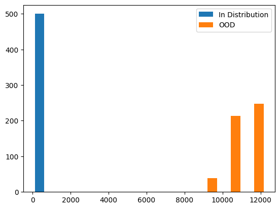

OOD Detection
================

<!-- WARNING: THIS FILE WAS AUTOGENERATED! DO NOT EDIT! -->

This library is used for OOD Detection where a model encounters new
classes at test time that were not seen during training. The goal is to
detect that such inputs do not belong to any of the training classes.


[](https://pypi.org/project/ood_detection/#description)
[](https://anaconda.org/yashkhandelwal/ood_detection)

## Install

``` sh
pip install ood_detection
```

or

``` sh
conda install -c yashkhandelwal ood_detection
```

## Example Usage

``` python
import numpy as np
from sklearn.datasets import make_blobs
from ood_detection.core import *
```

``` python
# example dataset
n_samples = 1000
n_centers = 10
n_features = 1024

x, y = make_blobs(n_samples=n_samples, n_features=n_features, centers=n_centers, random_state=0)
```

``` python
# using the last 5 cluster as the test and rest as train
train_embedding = x[np.where(y < (n_centers - 5))]
train_labels = y[np.where(y < (n_centers - 5))]

test_embedding = x[np.where(y >= (n_centers - 5))]
test_labels = y[np.where(y >= (n_centers - 5))]
```

``` python
ood = OODMetric(train_embedding, train_labels)

in_distribution_rmd = ood.compute_rmd(train_embedding)
ood_rmd = ood.compute_rmd(test_embedding)
```

``` python
plt.hist([in_distribution_rmd, ood_rmd], label=["In Distribution", "OOD"])
plt.legend()
plt.show()
```



## Built using NBDev

This OOD Detection library was built in a jupyter notebook with proper
documentation and test cases. These test cases are verified before they
are published to Github Pages, PyPi, Conda etc.

I’ve written down a [NBDev
Tutorial](https://yashwiai.github.io/ood_detection/tutorial.html)
explaining the thought process of Jeremy Howard and folks at FastAI
behind building it. The tutorial covers about how to get started,
important functions and description of those I used with the issues I
faced while exploring the tool for the first time.

## Acknowledgements

Special thanks to **[Yugam
Tiwari](https://www.linkedin.com/in/tiwari-yugam)** for explaining the
code he has written for the OODMetric and helping me packaging in the
library.

Thanks to **[Soma Dhavala](https://in.linkedin.com/in/somasdhavala)**
for coming up with the idea to prepare NBDev Tutorial and helping with
the initial reading and exploration material.
